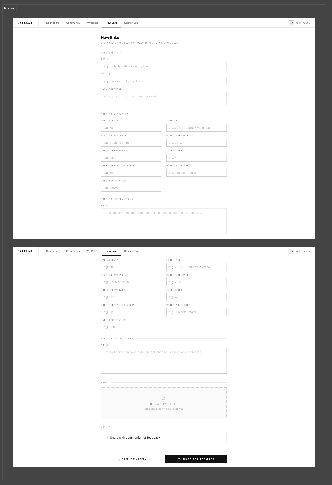
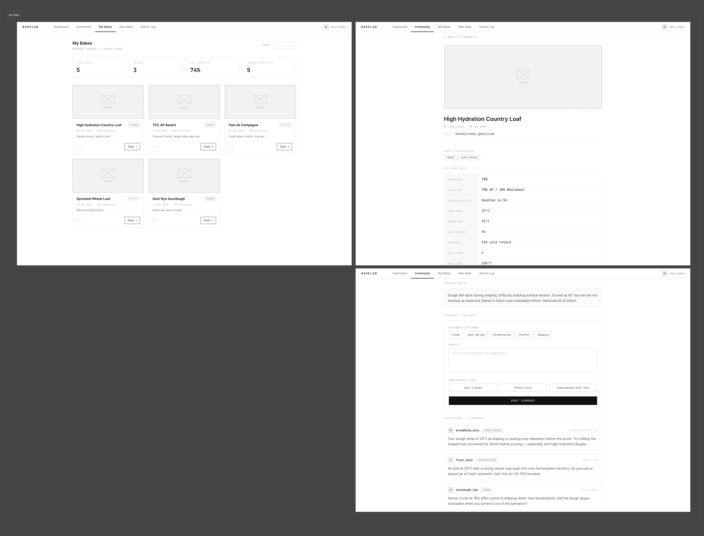
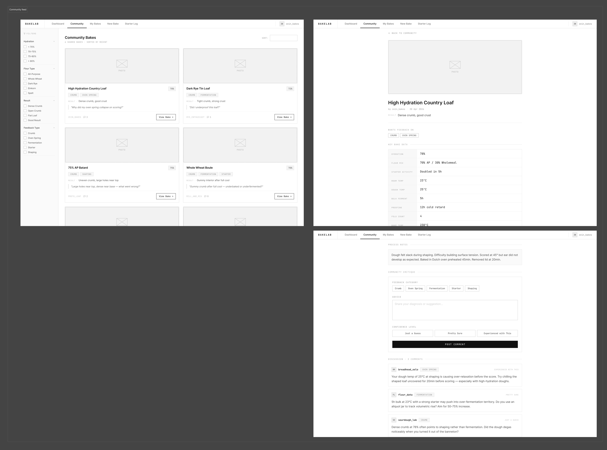
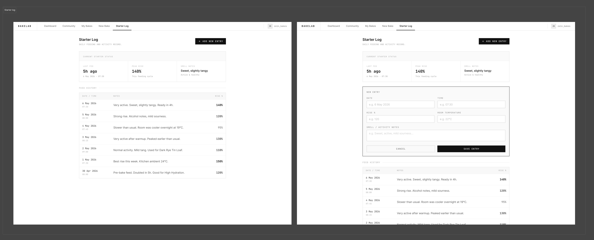

After interpreting the BlaBla Corp brief, the next step was to translate our research insights into **functional requirements**. This is important because a strong prototype should not just list features that sound useful. Each feature should respond to a specific **user need, research insight, or project constraint**. For BakeLab, our group needed to decide what the application must do for serious sourdough bakers, and what should be treated as optional.

The first core requirement is the ability to create a **structured bake record**. Our research showed that serious sourdough bakers care about **process variables**, not only final results. This means a normal post form would not be enough. A bake record should include information such as hydration, flour mix, starter activity, room temperature, dough temperature, fermentation time, fold count, result, notes, and photos. These fields help users record the context behind each bake, which is necessary for later reflection and troubleshooting.

The second requirement is the **ability to save a bake privately or share it publicly**. This is important because not every bake needs community feedback. Some users may want to keep a personal archive, while others may want advice from more experienced bakers. Separating private records from shared bakes also keeps the community feed more useful because it only shows bakes that are intentionally shared for discussion.

The third requirement is a community feed made of **structured bake cards**. Instead of designing the feed for passive scrolling, BakeLab should allow users to scan bakes based on meaningful details such as photo, hydration, result, question, and comment count. This supports the idea that the feed should be used for **diagnosis and learning**, rather than entertainment.

The fourth and most important requirement is the **bake detail or diagnosis page**. This page should show the full baking context before users give feedback. Community critique becomes more useful when commenters can see the formula, timing, notes, photos, and the baker’s specific question. To support this, feedback should also be structured through categories such as crumb, oven spring, fermentation, starter, shaping, or general advice. This avoids vague comments and makes the discussion easier to understand.

A starter log is another useful requirement because starter care is one of the repeated behaviours in sourdough baking. However, this feature should be kept lightweight. Its main purpose is to support **daily use through quick logging**, not to become a complex tracking system.

At this stage, our main scope decision is to separate essential features from optional ones. Essential features include creating bake records, saving or sharing them, viewing structured bake cards, opening a diagnosis page, and leaving categorised feedback. Optional features include advanced comparison, smart prompts, detailed statistics, notifications, or recommendation systems. These could be useful later, but they would make the first prototype too broad.

**AI Acknowledgement**

I acknowledge the use of ChatGPT to assist with generating summaries, writing image alt text, checking grammar, improving writing flow, and paraphrasing sentences.
