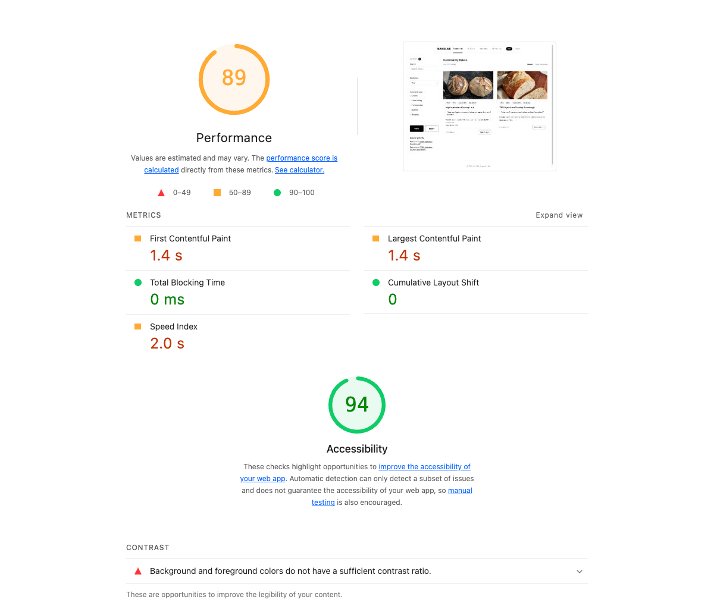
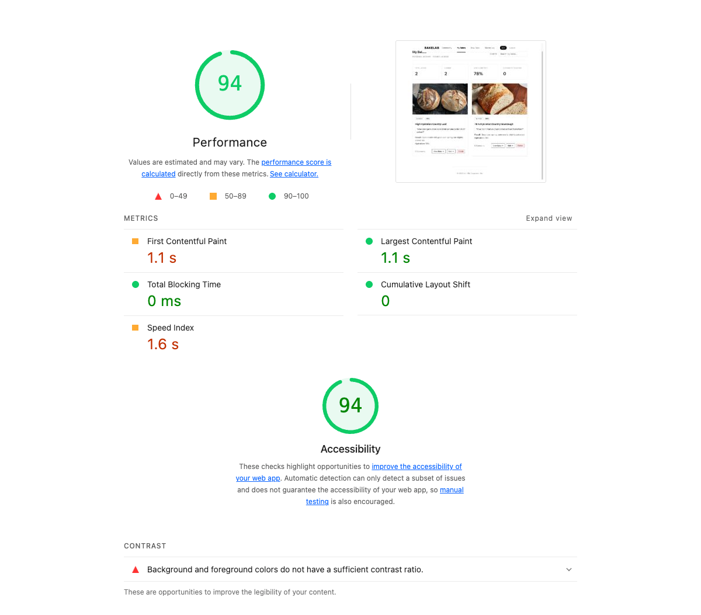
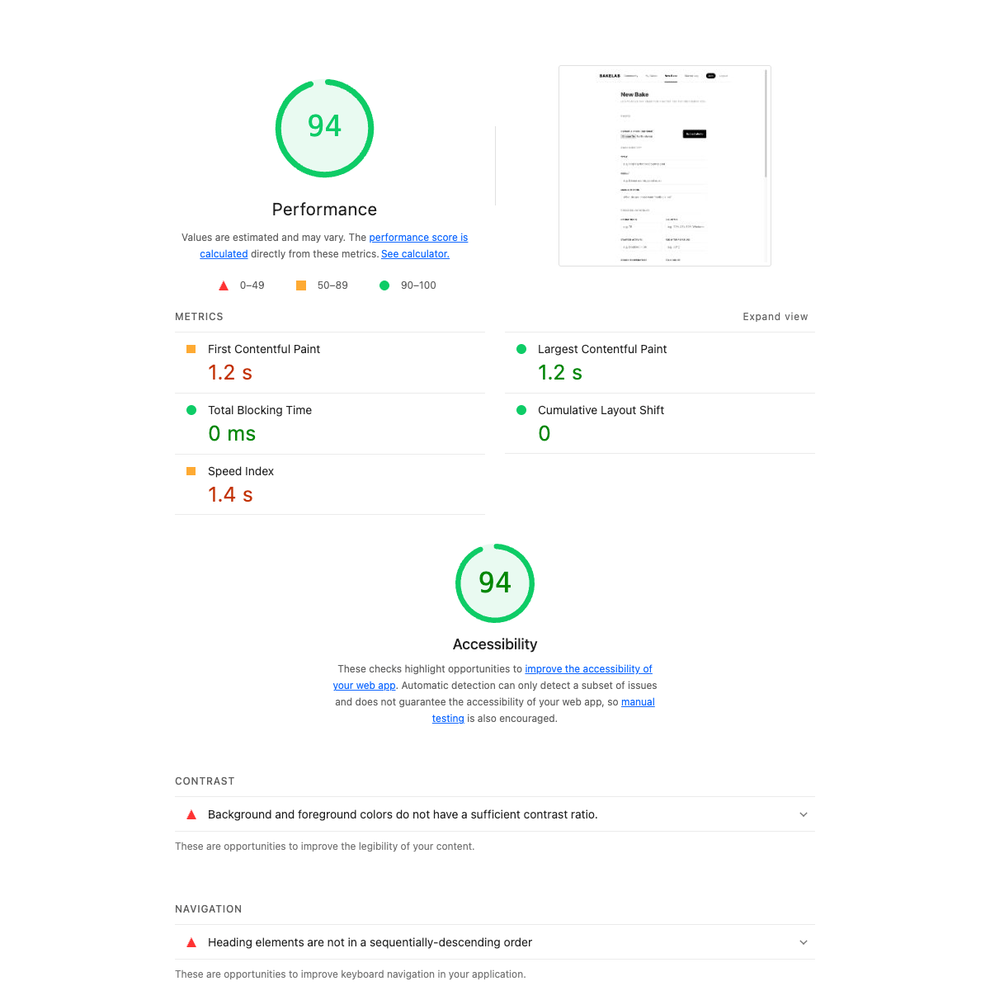
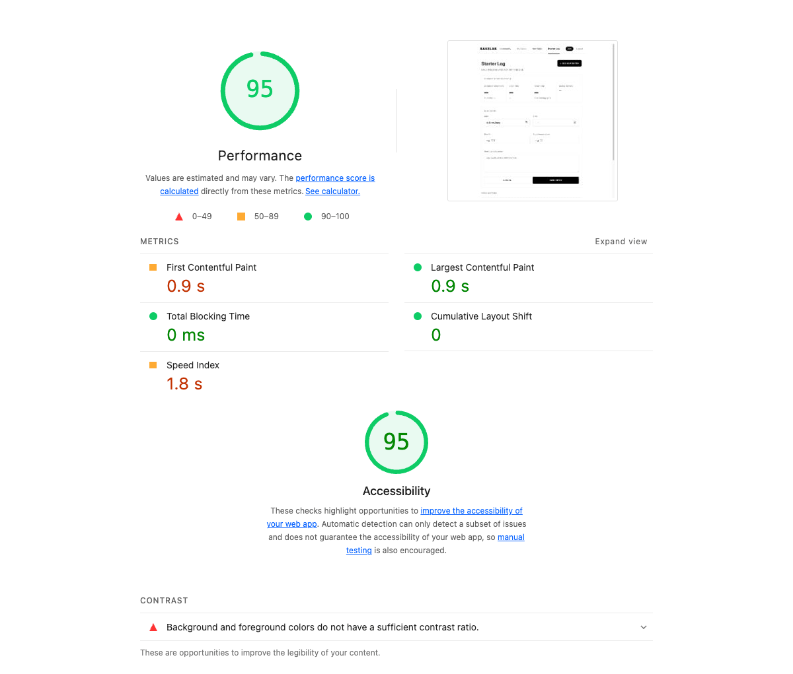
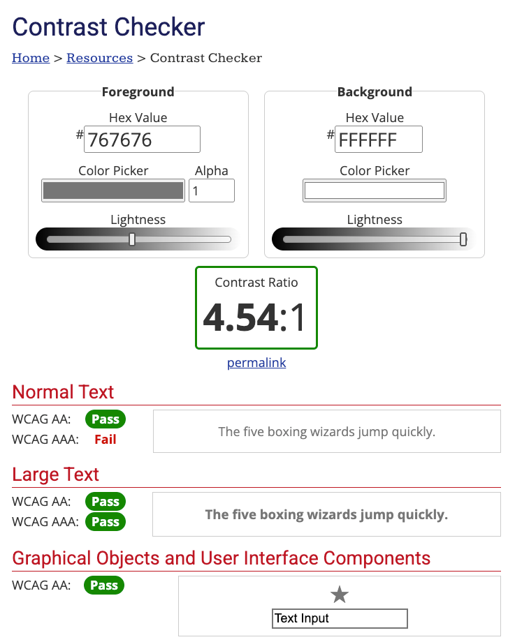

## Performance & Accessibility

To evaluate BakeLab’s technical performance and accessibility, our team used Lighthouse audits across four key pages: Community Feed, My Bakes, New Bake, and Starter Log. I also conducted a manual color contrast evaluation using the WebAIM Contrast Checker.

The Lighthouse performance scores were 89 for Community Feed, 94 for My Bakes, 94 for New Bake, and 95 for Starter Log. This suggests that most pages loaded efficiently and provided a stable experience. Accessibility scores ranged from 94 to 95 across all tested pages, while Best Practices scores consistently reached 100. SEO scores ranged from 90 to 91.

First Contentful Paint on the four core pages took between 0.9 and 1.4 seconds, whereas Largest Contentful Paint varied within the same range. Total Blocking Time remained 0 ms, which suggests that users were not significantly delayed from interacting with the interface. Cumulative Layout Shift was also 0 on all pages, which means the layout stayed stable while loading.

The accessibility evaluation indicated that the application generally followed good accessibility practices. Lighthouse identified only minor issues, including insufficient color contrast on some elements and heading hierarchy inconsistencies on the New Bake page. To further evaluate accessibility, we tested color contrast using the WebAIM Contrast Checker. The primary text colour (#767676) achieved a contrast ratio of 4.54:1 against a white background, meeting WCAG AA requirements for normal text. This helped ensure that key content remained readable while maintaining the visual style of the interface.

However, our prototype is designed primarily for desktop use. BakeLab would most likely be used in a kitchen environment, where users may record baking notes, upload photos, or check recipes from a mobile phone rather than a desktop computer. Consequently, future development should place greater emphasis on responsive design and mobile performance.

## User Experience

Usability testing was conducted with 5 participants ranging from beginners to experienced bakers. Most of the core tasks were completed successfully without problems, including creating a bake post, browsing community content, searching for information, leaving comments, and using the starter log. This suggests that the overall navigation structure was understandable to users and that the web supported its core goal of helping users document and discuss their baking process.

However, testing also revealed several issues. The most significant issue was about the Bake Creation form. Four out of five participants reported that the form felt overwhelming due to the large number of fields and technical baking variables. While experienced bakers appreciated the level of detail, beginners often struggled to understand what information was required and why it was important. This suggests that the current design creates unnecessary cognitive load for less experienced users.

The Flour Mix field was another recurring issue. Participants were required to manually enter flour percentages using free-text input, which caused confusion for both beginners and some experienced bakers. Several participants were unsure about the expected format, while others suggested that structured inputs would make the process easier and reduce errors. Based on this feedback, replacing the free-text field with dropdown flour selections and percentage inputs would be a high-priority improvement.

Testing also highlighted a terminology barrier for newer bakers. Terms such as “AP Flour” and “Starter Log” were familiar to experienced users but were confusing for beginners. Participants suggested the addition of tooltips, glossary links, and short explanations to provide context without interrupting the workflow. This would improve accessibility for new users while maintaining the detailed information valued by experienced bakers.

The structured feedback system was generally well received. Participants appreciated receiving targeted advice rather than generic comments and felt more confident providing feedback when clear prompts were available. However, some users expressed a desire for lighter forms of social interaction, such as quick compliments, reactions, or likes, alongside the structured critique system.

If development were to continue, the highest-priority improvements would be redesigning the Flour Mix input and simplifying the bake creation workflow through progressive disclosure or beginner-friendly modes. Medium-priority improvements would include contextual help systems and lightweight community reactions, while future iterations could introduce educational content and onboarding resources for novice bakers. These changes directly address the issues identified during testing and would likely improve usability across different experience levels.

## Functional Requirements

During the planning phase, our team planned to develop BakeLab as a platform where users will be able to document their baking process, exchange information about it, leave comments, and track long-term starter log. Compared to the plans, most core functionality was delivered as intended. Usability testing showed that participants were able to complete all major tasks without assistance, suggesting that the primary user flows were successfully implemented. In this sense, the prototype met its main objective of supporting baking documentation and community-based learning.

However, some features were deprioritized due to project scope and time constraints. For example, user authentication and personalized account management were discussed during development but were not implemented in the final prototype. These features would become increasingly important if BakeLab were developed into a larger community platform, particularly for managing user-generated content and personal baking records.

## Lessons Learned

Working on this project made me reconsider my opinion on what makes a successful web application. Initially, I thought that having more features and gathering as much information as possible would create a better experience. However, after user testing, I understood that the presence of some additional features can also increase complexity and barriers. Several features that were technically successful, such as detailed baking variables, were not always easy for participants to understand or use. This taught me that effective web design is the one that strikes a balance between functionality and usability.

From a technical perspective, I developed a much stronger understanding of how a full-stack web application operates. Through implementing features such as creating posts, storing data, filtering content, and managing user interactions, I gained experience working with data flows rather than treating each page as an isolated interface. I also learned how to evaluate a deployed application using tools such as Lighthouse, which helped me think beyond whether a feature works and instead consider how efficiently and accessibly it works.

The project also improved my understanding of project scoping. Early in development, I wanted to include a wide range of features, but I quickly realized that limited time and resources required prioritization. This led to decisions such as focusing on core user flows while postponing features like authentication and personalized account management. As a result, I learned that reducing scope is not necessarily a compromise; it can be a deliberate strategy for delivering a more complete and usable product.

Perhaps the most important lesson was that web development does not end when implementation is finished. User testing revealed issues that were not obvious during design and development, including terminology barriers, form complexity, and confusion around certain inputs. This demonstrated that evaluation and iteration are just as important as implementation. Rather than viewing development as a process of building features, I now see it as an ongoing cycle of designing, testing, learning, and refining based on real user behavior.

**AI Acknowledgement**

I acknowledge the use of ChatGPT to assist with generating summaries, writing image alt text, checking grammar, improving writing flow, and paraphrasing sentences.
